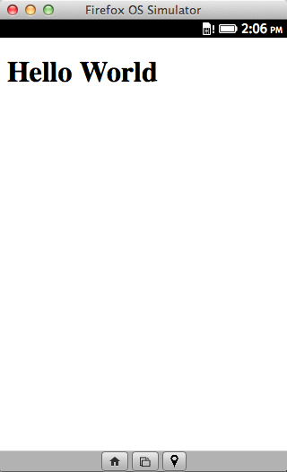
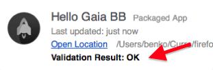
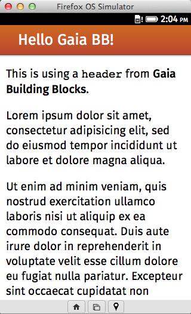

# Firefox OS Workshop

This is the source code to support our **Firefox OS workshops**.

## Installation and requirements

Requirements:

- [Firefox Nightly](http://nightly.mozilla.org), the bleeding-edge version of Firefox.
- Firefox OS Simulator, which is actually an extension for Firefox. Open [this link](https://addons.mozilla.org/firefox/addon/firefox-os-simulator/) from Firefox to install it.

You can just [download the code](https://github.com/belen-albeza/ffxos-workshop/archive/master.zip), [fork it](https://github.com/belen-albeza/ffxos-workshop/fork) or clone it with Git:

```bash
git clone git@github.com:belen-albeza/ffxos-workshop.git
```

To run the apps in the **simulator**:

1. Open Firefox Nightly.
2. Go to `Tools / Web Developer / Firefox OS Simulator`.
3. Click on the `Add Directory` button.
4. Browse and select one of the examples' `manifest.webapp` files.
5. Enjoy!

To run the apps locally in Firefox Nightly (very useful for development), you will need to **launch a local server** in your app's directory.

If you have Python in your system (comes pre-installed in Mac OS X and most Linux distros), you can easily run it by `cd` to the desired app directory and executing: 
 
```bash
python -m SimpleHTTPServer
```

1. Open the URL of your app in Firefox Nightly. If you use the previous Python line, then just go to `0.0.0.0:8000`.
2. Enable the Responsive View so it mimics how it's seen in the device. Go to `Tools / Web Developer / Responsive View`

## Demo apps

### Hello World

Located at `hello-world`.



This a simple Hello World application, that shows how to set up a minimal manifest (the `manifest.webapp` file) so your web app is actually a Firefox OS app.

You need to create a `manifest.webapp` file for your app. You can find [documentation in the MDN](https://developer.mozilla.org/en-US/Apps/Developing/Manifest).

Note that it is mandatory that your app has icons! You will need `60x60`, `120x120` and `128x128` images.

You can see if your manifest file is valid in the Firefox OS Simulator.



### Hello Gaia BB

Located at `hello-world-gaiabb`.



This shows how to include and use [Gaia Building Blocks](http://www.buildingfirefoxos.com) in your app.

First you need to [download the Building Blocks](http://buildingfirefoxos.com/downloads/) and then copy the CSS stylesheets and their folders of the specific blocks that you want to use. In this example we are using the `headers` block, so we copied the `style/headers.css` file and the `style/headers` folder to our application.

There are additional blocks you can use in `style_unstable` too. And there's also a `util.css` file with some CSS rules that will make your life easier (for instance, it sets a reasonable base `font-size` for the application). We have included this stylesheet in this demo.

The standard font that comes with Firefox OS is `Feura Sans`, which you can [download](http://buildingfirefoxos.com/downloads/) (to be able to test your apps in a desktop browser).

After you have included the CSS stylesheets in your HTML document, **you need to add the attribute** `role="application"` to your body tag. If you don't do this, the Building Blocks won't work.

To put a Building Block in your app, you need to use a specific HTML code. You can grab this code from the `index.html` file in each Building Block folder, or from the Building Firefox OS page. For instance, [this is the code](http://buildingfirefoxos.com/building-blocks/headers.html) that you need to use for a simple heading:

```html
  <section role="region">
    <header>
      <h1>Hello Gaia BB!</h1>
    </header>
  </section>
```

One common pattern in applications is to have the header always visible on top, and then make only the rest of the window scrollable. You can have this behavior easily if you include the `util.css` stylesheet in your app. Then you need to add the class `fixed` to the header, and put your content inside an `<article>` with the classes `scrollable header`. For example:

```html
<body role="application">
  <section role="region">
    <header class="fixed">
      <h1>Rainbows</h1>
    </header>
    <article class="scrollable header">
      <p>Sparkling unicorns!</p>
    </article>
  </section>
</body>
```

### Contacts WebAPI

Located at `webapi-contacts`.

TODO screenshot.

#### Permissions and certified apps

You need to specify the permissions that you need the user to grant. Also, the Contacts WebAPI is only available at privileged or certified apps; that is, apps from the Marketplace or system apps.

To mark our app as privileged (to be distributed via a Marketplace), you need to update the manifest with the `type` setting. Permissions are stored int he `permissions` keys. You can find a list of all permissions and their different options [in the MDN](https://developer.mozilla.org/en-US/Apps/Developing/App_permissions). TODO link to documentation with list on permissions and another link to info about privileged and certified apps.

For this demo, we need to ask for reading access, so we can display the contacts list.

```json
"type": "privileged",
"permissions": {
  "contacts": {
    "description": "Required to display your contacts",
    "access": "readonly"
  }
}
```

#### Contacts WebAPI

